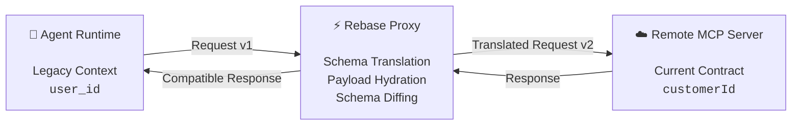
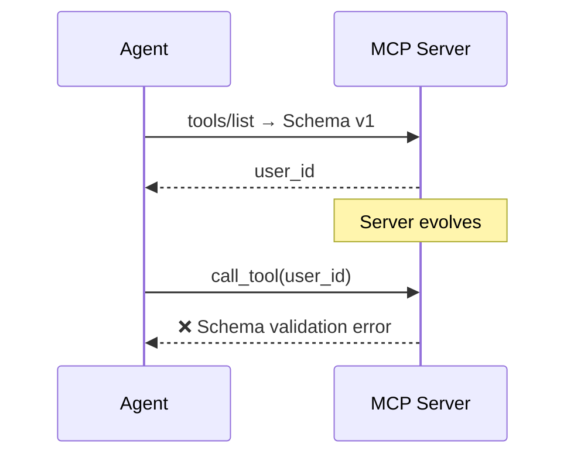
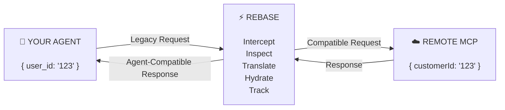
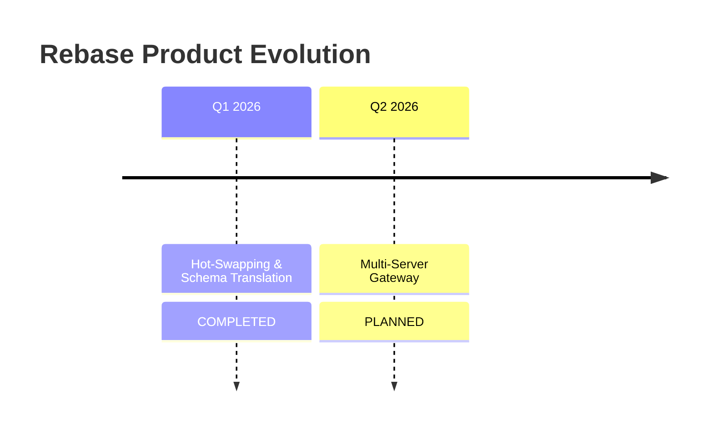
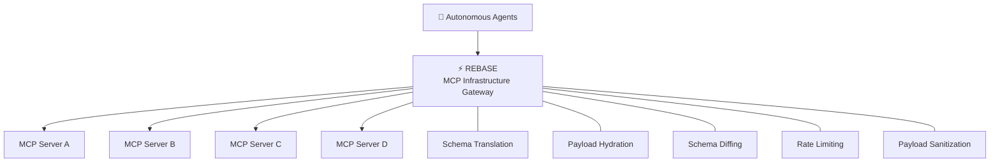

# Rebase

### A Real-Time Schema Translation Layer for Resilient Model Context Protocol Infrastructure

[](https://modelcontextprotocol.io/)
[](#)
[](#)

> **Rebase keeps autonomous agents operational when upstream MCP tool schemas evolve.**
>
> It sits between an agent runtime and remote MCP servers, translating legacy payloads into the currently accepted upstream schema without requiring agent code changes or prompt rewrites.

---

## Executive Summary

As AI architectures transition from static completion models toward autonomous multi-agent orchestration, the **Model Context Protocol (MCP)** has emerged as a standard protocol for connecting Large Language Models (LLMs) with external tools, APIs, and data stores.

However, integrating distributed, third-party MCP servers introduces a structural reliability challenge:

> **Upstream Schema Drift**

When remote tool providers modify parameter contracts, rename payload fields, or alter tool signatures after deployment, downstream agent execution can break at the payload boundary.

This creates a difficult operational problem:

```text
Agent Context
     │
     │ Legacy schema
     ▼
┌─────────────────────┐
│   Agent Runtime     │
└──────────┬──────────┘
           │
           │ ❌ incompatible payload
           ▼
┌─────────────────────┐
│  Remote MCP Server  │
│     New Schema      │
└─────────────────────┘
           │
           ▼
     Execution Failure
```

Re-training agents, modifying system prompts, or stopping execution for developer intervention introduces operational downtime and breaks autonomous multi-step workflows.

### Rebase

Rebase introduces an **inline schema translation and compatibility proxy** between the agent runtime and remote MCP infrastructure.



Rebase performs:

* Real-time payload translation
* Schema hydration
* Structural schema diffing
* Compatibility handling
* Metadata-based observability

without requiring modifications to the agent's reasoning loop.

---

# 1. Problem Statement

## The Fragility of Distributed MCP Infrastructure

In a production MCP system, autonomous agents construct execution plans based on tool contracts exposed during initial tool discovery:

```text
tools/list
    │
    ▼
┌─────────────────────┐
│ Tool Schema v1      │
│                     │
│ user_id             │
│ email               │
│ account_type        │
└──────────┬──────────┘
           │
           ▼
      Agent Context
```

The problem occurs when the upstream server evolves independently:



The agent still possesses the old contract while the remote service expects the new one.

---

## The Three Phases of Infrastructure Failure

### 1. Remote Schema Evolution

Upstream MCP servers modify tool parameters.

For example:

```diff
{
-  "user_id": "123"
+  "customerId": "123"
}
```

This may happen because of:

* Backend migrations
* Database schema changes
* API refactoring
* Naming standardization
* Third-party service updates

---

### 2. Execution & Context Mismatch

The downstream agent continues generating calls according to its previously discovered schema.

```json
{
  "user_id": "123"
}
```

while the upstream server now expects:

```json
{
  "customerId": "123"
}
```

The agent does not necessarily have the context required to reconstruct the new contract.

---

### 3. Pipeline Breakdown

The upstream server rejects the payload.

```text
Agent
  │
  │ { user_id: "123" }
  ▼
MCP Server
  │
  ├── Expected: customerId
  │
  └── ❌ Validation Error
           │
           ▼
    Agent Workflow Stops
```

For autonomous multi-step workflows, one incompatible tool call can interrupt the entire execution chain.

---

# 2. The Rebase Solution

Rebase acts as a compatibility layer between the agent and the upstream MCP server.



### Translation Example

The agent continues operating against its existing contract:

```json
{
  "user_id": "123"
}
```

Rebase translates the payload:

```diff
- user_id
+ customerId
```

The upstream server receives:

```json
{
  "customerId": "123"
}
```

### The important property

```text
          WITHOUT REBASE

Agent ────────────────► MCP Server
       Legacy Payload       New Schema
              ❌


          WITH REBASE

Agent ───► Rebase ───► MCP Server
 Legacy      │          New Schema
 Payload     │
             └── Translation
                    ✓
```

The agent does not need to be rewritten simply because the upstream contract changed.

---

# Core Technical Architecture

| Layer                 | Responsibility                                   |
| --------------------- | ------------------------------------------------ |
| **Agent Runtime**     | Generates tool calls using its existing context  |
| **Rebase Proxy**      | Intercepts and evaluates MCP traffic             |
| **Schema Translator** | Maps legacy payload structures to active schemas |
| **Hydration Layer**   | Handles compatible missing parameters            |
| **Diff Engine**       | Detects structural schema changes                |
| **Metadata Layer**    | Exposes schema evolution telemetry               |
| **Remote MCP Server** | Executes the translated request                  |

---

# Core Technical Pillars

## 🔄 In-Flight Schema Translation

Rebase intercepts non-conforming parameters and dynamically maps them to the active upstream contract.

Example:

```json
{
  "user_id": "123"
}
```

↓

```text
Rebase Translation

user_id
   │
   ▼
customerId
```

↓

```json
{
  "customerId": "123"
}
```

The transformation occurs **at the payload boundary**, rather than inside the agent.

---

## 🛡️ Payload Hydration Shielding

Minor schema expansions do not necessarily need to break an existing workflow.

For example, if an upstream tool evolves from:

```json
{
  "customerId": "123"
}
```

to:

```json
{
  "customerId": "123",
  "region": "default"
}
```

Rebase can hydrate compatible missing parameters where appropriate:

```json
{
  "customerId": "123",
  "region": "default"
}
```

This allows compatible schema evolution without immediately forcing agent-side changes.

---

## 🧠 Prompt Cache Protection

Changing a tool signature can force agent runtimes to update the context supplied to the model.

That can introduce:

```text
Schema Change
     │
     ▼
Tool Definition Change
     │
     ▼
Agent Context Change
     │
     ▼
Prompt/KV Cache Disruption
     │
     ▼
Additional Inference Cost
```

Rebase isolates the agent from upstream schema changes wherever compatibility translation is possible.

```text
                 ┌──────────────────────┐
                 │    Agent Context     │
                 │                      │
                 │     Stable Schema    │
                 └──────────┬───────────┘
                            │
                            ▼
                     ┌─────────────┐
                     │    Rebase   │
                     │             │
                     │ Translation │
                     └──────┬──────┘
                            │
                            ▼
                 ┌──────────────────────┐
                 │  Changing Upstream   │
                 │       Schema         │
                 └──────────────────────┘
```

---

## 📊 Metadata Schema Diffing

Rebase can capture structural changes between observed schemas.

Example:

```diff
Tool: get_customer

Schema v1
- user_id
- email

Schema v2
+ customerId
+ email
+ region
```

These changes can be surfaced through centralized `_meta` telemetry.

Example:

```json
{
  "_meta": {
    "rebase": {
      "status": "DRIFT",
      "changes": [
        {
          "type": "rename",
          "from": "user_id",
          "to": "customerId"
        },
        {
          "type": "added",
          "field": "region"
        }
      ]
    }
  }
}
```

This provides engineering teams with visibility into schema evolution while allowing compatible traffic to continue.

---

# 3. Quick Start

Integrating Rebase requires no modifications to the core agent reasoning loop.

The architecture is intentionally simple:

```text
                 Existing Agent
                      │
                      │
                      ▼
              localhost:8080/mcp
                      │
                      ▼
               ┌─────────────┐
               │   REBASE    │
               │    PROXY    │
               └──────┬──────┘
                      │
                      ▼
             Remote MCP Server
```

---

## Step 1 — Launch Rebase

Execute the Rebase CLI against your target remote MCP server:

```bash
npx rebase-p rebase --target <remote-mcp-server-url> --port 8080
```

---

## Step 2 — Configure Client Agent Connection

Point the MCP transport layer at the Rebase proxy:

```python
from mcp_client import MCPServerStreamableHttp, Agent

# Configure transport client to connect directly
# to the local Rebase proxy endpoint

proxy = MCPServerStreamableHttp(
    "http://localhost:8080/mcp"
)

# Initialize your agent worker attached
# to the Rebase transport proxy

agent = Agent(
    name="Worker",
    mcp_servers=[proxy]
)
```

---

## Step 3 — Execute Agent Workflows

The agent continues using its existing parameters:

```python
# Agent continues using its original schema

agent.run("Get customer 123")
```

Execution path:

```text
1. Agent emits

   { user_id: "123" }

              │
              ▼

2. Rebase intercepts the request

              │
              ▼

3. Rebase translates

   user_id → customerId

              │
              ▼

4. Upstream receives

   { customerId: "123" }

              │
              ▼

5. Remote MCP server executes successfully
```

### No Agent Rewrite

```text
          Agent Code
              │
              │ unchanged
              ▼
          ┌────────┐
          │ Rebase │
          └───┬────┘
              │
              │ adapted
              ▼
        Remote Service
```

---

# 4. Product Roadmap

Rebase is evolving from a single-endpoint schema translation proxy into a **multi-server MCP gateway**.



---

## Q1 2026 — Hot-Swapping & Schema Translation

**Status:** 

Middleware layer built for real-time payload translation and automated fallback handling when upstream tool schemas change mid-session.

### Key Deliverables

* **Automatic payload hydration**

  Dynamically fills compatible required default values when minor parameters are introduced upstream.

* **Centralized `_meta` schema diff reporting**

  Provides real-time telemetry and schema audit information through JSON-RPC metadata extensions.

* **Prompt cache protection**

  Shields the agent runtime from unnecessary context updates caused by compatible upstream tool signature changes.

---

## Q2 2026 — Multi-Server Gateway

**Status:** 

Aggregate multiple upstream MCP servers into a single unified routing endpoint.

### Key Deliverables

#### 🌐 Multi-Server Tool Aggregation

Combine heterogeneous remote MCP servers under a single routing domain.

```text
                 ┌─────────────────┐
                 │   Agent Runtime │
                 └────────┬────────┘
                          │
                          ▼
                 ┌─────────────────┐
                 │ Rebase Gateway  │
                 └────────┬────────┘
                          │
              ┌───────────┼───────────┐
              ▼           ▼           ▼
         ┌────────┐  ┌────────┐  ┌────────┐
         │ MCP A  │  │ MCP B  │  │ MCP C  │
         └────────┘  └────────┘  └────────┘
```

Includes:

* Tool aggregation
* Namespace management
* Tool-name collision resolution
* Unified routing

---

#### 🚦 Rate Limiting & Payload Sanitization

Provide a governance boundary between autonomous agents and upstream infrastructure.

```text
Incoming Request
       │
       ▼
┌────────────────────┐
│ Rate Limiting      │
├────────────────────┤
│ Payload Sanitizing │
├────────────────────┤
│ Schema Translation │
├────────────────────┤
│ Schema Validation  │
└─────────┬──────────┘
          │
          ▼
   Remote MCP Server
```

This creates a single enforcement point for traffic governance, request throttling, payload sanitization, and schema compatibility.

---

# Architectural Vision

Rebase aims to make MCP infrastructure resilient to the independent evolution of its components.



### The Core Idea

> **Agents should not have to break every time the infrastructure they depend on evolves.**

Rebase moves compatibility from the agent layer into the infrastructure layer.

```text
Before Rebase

Agent
  │
  └────────── tightly coupled ──────────► MCP Server


After Rebase

Agent
  │
  ▼
Rebase
  │
  ├── Translation
  ├── Hydration
  ├── Diffing
  ├── Rate Limiting
  ├── Payload Sanitization
  │
  ▼
MCP Infrastructure
```

---

# Rebase

**A compatibility layer for evolving MCP infrastructure.**

> **Change the upstream schema. Keep the agent running.**
